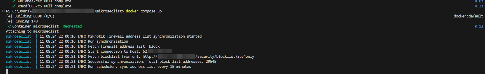

# MikroSecList - Mikrotik Security List

[](https://github.com/akmalovaa/mikroseclist)

RouterOS firewall address list synchronization to CrowdSec Blocklist Mirror 

- [DockerHub crowdsec](https://hub.docker.com/r/crowdsecurity/crowdsec)
- [DockerHub blocklist-mirror](https://hub.docker.com/r/crowdsecurity/blocklist-mirror)
- [Docs Blocklist mirror](https://docs.crowdsec.net/u/bouncers/blocklist-mirror#installation/)

### Guide 

Configure Blocklist Mirror or use your own list of IP addresses *(need HTTP format output list)*

*`config.yml`*
```yaml | code
blocklists:
  format: plain_text
```

### Prepare Router OS

Create certifcates
```
/certificate
add name=CA-Template common-name=CAtemp key-usage=key-cert-sign,crl-sign
add name=Server common-name=server
add name=Client common-name=client
```

Certificates should be signed. 
**Change your RouterOS host address**
```
/certificate
sign CA-Template
sign Client     
sign Server ca-crl-host=192.168.88.1 name=ServerCA
```

Enable API-SSL. **Change api access address**
```
/ip service
set api-ssl address=192.168.88.0/24 certificate=ServerCA
```

### Docker compose

change `.env` file variables
```
cp .env.exmaple .env
nano .env
```

build
```bash
docker build . -t mikroseclist:latest
```

or use github image

```bash
docker pull ghcr.io/akmalovaa/mikroseclist:latest
```

using docker compose - `compose.yaml`

```yaml
services:
  mikroseclist:
    image: ghcr.io/akmalovaa/mikroseclist:latest
    container_name: mikroseclist
    command: ["python", "-m", "mikroseclist"]
    environment:
      MIKROTIK_HOST: ${MIKROTIK_HOST:-'192.168.88.1'}
      MIKROTIK_USER: ${MIKROTIK_USER:-'admin'}
      MIKROTIK_PASSWORD: ${MIKROTIK_PASSWORD:-'password'}
      BLOCKLIST_URL: 'http://blocklist.example.com:41412/security/blocklist?ipv4only'
      SYNC_INTERVAL_MIN: 30
    restart: unless-stopped
```

change environment variables and run:

```bash
docker-compose up -d
```

[](https://github.com/akmalovaa/mikroseclist/blob/main/crowdsec_blocklist/mikroseclist_logs.png)

After first syncing сhange Mikrotik Firewall Rules
```sh
/ip firewall filter
add action=accept chain=input src-address-list=access # access list optional
add action=drop chain=input in-interface=ether1 src-address-list=block
add action=drop chain=forward in-interface=ether1 src-address-list=block
```

### Settings

https://github.com/akmalovaa/mikroseclist/blob/main/mikroseclist/settings.py

You can override this variables in the `.env` file


## CrowdSec block lists sync

You can use default **CrowdSec Blocklist mirror** format without `mikroseclist` service:

This app constantly synchronizes and updates the firewall address list in mikrotik.

Actual dangerous IP addresses will already be in the blocked list

[CrowdSec Blocklist mirror](https://docs.crowdsec.net/u/bouncers/blocklist-mirror/#installation/)

Allows you to use a list of IP addresses to add

*`config.yml`*
```yaml | code
blocklists:
  format: mikrotik
```
Output lines for mikrotik, format is `/ip|/ipv6 firewall address-list add list={list_name} address={ip} comment="{scenario} for {duration}"`

The list of dangerous IP addresses is very large ~ 25,000, when updated in this way, all addresses are deleted and added again. It's pointless to do this every time you update.

This service only allows you to edit changes. Delete something, add something