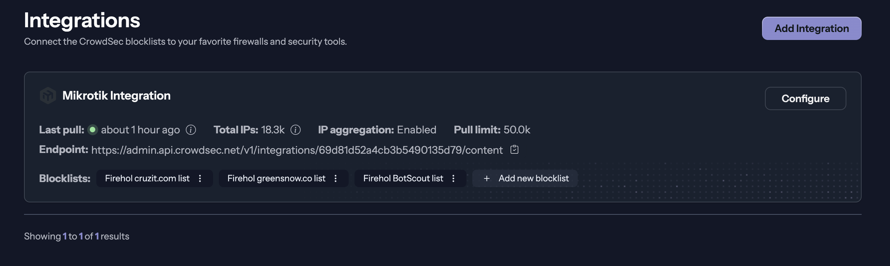
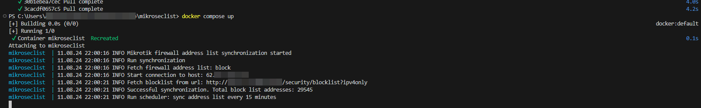

# MikroSecList - Mikrotik Security List

[](https://github.com/akmalovaa/mikroseclist)

RouterOS firewall address list synchronization to CrowdSec Blocklist Mirror

- [DockerHub crowdsec](https://hub.docker.com/r/crowdsecurity/crowdsec)
- [DockerHub blocklist-mirror](https://hub.docker.com/r/crowdsecurity/blocklist-mirror)
- [Docs Blocklist mirror](https://docs.crowdsec.net/u/bouncers/blocklist-mirror#installation/)

## Simple Alternative: CrowdSec native Mikrotik integration

CrowdSec offers a built-in [Mikrotik integration](https://app.crowdsec.net/blocklists/integrations) via their console. The endpoint returns ready-made RouterOS commands:

[](https://app.crowdsec.net/blocklists/integrations)

```routeros
/ip firewall address-list add list=crowdsec-integration address=1.12.48.131/32 comment="crowdsec/Mikrotik Integration" timeout=48h;
```

MikroTik can fetch and execute this script directly using a scheduler:

```routeros
/system scheduler add name=crowdsec-update interval=24h \
  on-event="/tool fetch url=\"https://admin.api.crowdsec.net/v1/integrations/<id>/content\" \
  user=<user> password=<password> dst-path=crowdsec.rsc; /import crowdsec.rsc"
```

The `timeout=48h` on each entry ensures stale IPs are automatically removed.

### Comparison: **CrowdSec native** vs **MikroSecList**

| | **CrowdSec native** | **MikroSecList** |
|---|---|---|
| **Format** | Ready RouterOS commands | Plain IP list |
| **Delivery** | MikroTik fetches script via `/tool fetch` + `/import` | Python service pushes via RouterOS API |
| **Sync method** | Full overwrite (timeout-based auto-cleanup) | Diff-based (add new, remove stale) |
| **Dependencies** | None, runs on MikroTik itself | Docker container with Python |
| **Update frequency** | Once per 24h (free plan limit) | Any interval (depends on blocklist source) |
| **TTL** | Built-in `timeout=48h` | Manual removal via API |
| **Address list name** | Fixed `crowdsec-integration` | Configurable (`MIKROTIK_ADDRESS_LIST_NAME`) |
| **Blocklist source** | CrowdSec only | Any HTTP blocklist URL (multiple supported) |

### When to use which

- **CrowdSec native** — simpler setup, no external dependencies. Good if you only need CrowdSec blocklists and daily updates are sufficient.
- **mikroseclist** — more control: precise diff-based sync, any blocklist source, configurable update interval, custom list names. Better for frequent updates or multiple blocklist sources.

## Getting Started

### Prerequisites

You need a blocklist source that returns plain IP lists (one IP per line). For example, CrowdSec Blocklist Mirror (self-hosted): https://github.com/akmalovaa/crowdsec-blocklist

### Prepare RouterOS

Create certificates:

```routeros
/certificate
add name=CA-Template common-name=CAtemp key-usage=key-cert-sign,crl-sign
add name=Server common-name=server
add name=Client common-name=client
```

Sign the certificates. **Change the host address to your RouterOS IP:**

```routeros
/certificate
sign CA-Template
sign Client     
sign Server ca-crl-host=192.168.88.1 name=ServerCA
```

Enable API-SSL. **Change the access address to your network:**

```routeros
/ip service
set api-ssl address=192.168.88.0/24 certificate=ServerCA
```

### Configuration

All settings are configured via environment variables (`.env` file):

| Variable | Default | Description |
|---|---|---|
| `MIKROTIK_HOST` | `192.168.88.1` | RouterOS host |
| `MIKROTIK_USER` | `admin` | API username |
| `MIKROTIK_PASSWORD` | `12345` | API password |
| `BLOCKLIST_URLS` | `http://blocklist:41412/...` | Comma-separated URLs to fetch IP blocklists |
| `SYNC_INTERVAL_MIN` | `30` | Sync interval in minutes |
| `LOG_LEVEL` | `INFO` | Logging level |
| `MIKROTIK_ADDRESS_LIST_NAME` | `block` | Firewall address list name |
| `MIKROTIK_LOG_MESSAGE` | `true` | Log sync start to RouterOS log |

```shell
cp .env.example .env
nano .env
```

### Run with Docker Compose

Using the pre-built image from GitHub Container Registry:

```bash
docker compose up -d
```

Or build locally:

```bash
docker build . -t mikroseclist:latest
```

[](https://github.com/akmalovaa/mikroseclist/blob/main/docs/mikroseclist_logs.png)

> **Note:** The first sync may take a while since all addresses are added one by one via the RouterOS API. Subsequent syncs are fast — only the difference (new/removed addresses) is applied.

### Firewall Rules

After the first sync, add firewall rules to use the blocklist:

```routeros
/ip firewall filter
add action=accept chain=input src-address-list=access # access list (optional)
add action=drop chain=input in-interface=ether1 src-address-list=block
add action=drop chain=forward in-interface=ether1 src-address-list=block
```

## Mikrotik containerized

Guide in progress
